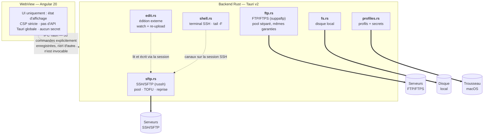

# Charon

**Le passeur de fichiers.** Client SFTP / FTPS / FTP privé pour macOS et
Windows. Backend **Rust** (Tauri v2), interface **Angular 20** (signals,
zoneless, OnPush). Pensé pour un usage personnel puis professionnel : la
sécurité est un objectif de conception, pas une couche ajoutée après coup.

Version : **1.2.0** « Légion » · macOS (Apple Silicon) et Windows x64 ·
Mises à jour signées intégrées.

---

## Sommaire

- [Fonctionnalités](#fonctionnalités)
- [Démarrage](#démarrage)
- [Architecture](#architecture)
- [Sécurité](#sécurité)
- [Pourquoi ne pas écrire notre propre SSH ?](#pourquoi-ne-pas-écrire-notre-propre-ssh-)
- [Release et déploiement](#release-et-déploiement)
- [Stack](#stack)

---

## Fonctionnalités

### Connexions

| | |
|---|---|
| **Protocoles** | SFTP (principal), FTPS (AUTH TLS, certificats validés par le système), FTP legacy avec avertissement « en clair » permanent |
| **Authentification** | Clé SSH — auto-détection `~/.ssh` (ed25519 en priorité) ou chemin explicite, passphrase supportée ; mot de passe en repli |
| **Profils multi-serveurs** | Hôte/port/utilisateur/clé dans un store JSON ; **secrets exclusivement dans le trousseau macOS** ; la liste n'affiche que le nom du profil, jamais l'hôte |
| **Pool persistant** | Un transfert long ne bloque ni la navigation ni les autres transferts ; keepalive 30 s ×3 |
| **Fermeture d'inactivité** | Délai réglable (15 min par défaut, 0 = jamais) ; un transfert, un terminal, un suivi de log ou une édition en cours **suspendent** la fermeture |

### Sessions

Plusieurs serveurs dans la même fenêtre. Chaque session est complète et
indépendante : sa connexion, son historique, ses transferts, son terminal.

| | |
|---|---|
| **Onglets de session** | `Cmd+T` ouvre une session, `Cmd+W` la ferme, `Cmd+⌥+←/→` navigue. Les transferts d'un onglet en veille continuent de courir |
| **Vue double** | Deux serveurs côte à côte, chacun avec son panneau et son terminal. Clic droit sur un onglet → « Côte à côte avec … » |
| **Pont entre serveurs** | Copier, couper, coller et glisser des fichiers **d'un serveur à l'autre**, en flux direct par blocs de 1 Mio, sans jamais toucher le disque local |
| **Couleurs d'identité** | Une teinte par session, portée par son onglet, son panneau, son terminal et ses lignes de transfert |
| **Fenêtres multiples** | `Cmd+N` ouvre une seconde fenêtre complète ; le glissé traverse de l'une à l'autre, et thème, réglages, profils et modules restent synchronisés |
| **Rattachement au reload** | Recharger la fenêtre restaure les onglets, la vue double et le focus : chaque session retrouve sa connexion, restée vivante |

### Explorateur — panneaux librement réagençables

Un dock façon éditeur de code : des panneaux à glisser, empiler en onglets,
redimensionner, fermer et rouvrir — disposition persistée. Dépôt au **centre**
d'un groupe = onglet ; sur un **bord** = split ; sur un **bord de la fenêtre**
= le panneau prend tout le côté. Le DOM n'est jamais recréé : terminal, logs
et positions de scroll **survivent aux réagencements**.

| Panneau | Contenu |
|---|---|
| **Serveur** | Fichiers distants, fil d'Ariane, drag & drop d'upload depuis le Finder |
| **Local** | Cet ordinateur (navigation, envoi vers le serveur) |
| **Arborescence** | Arbre complet du serveur (dossiers **et** fichiers, lignes de guidage, chargement paresseux) |
| **Aperçu** | Un éditeur : onglets de fichiers, coloration syntaxique, numéros de ligne, recherche interne, formatage à l'enregistrement, images zoomables, diff entre deux serveurs |
| **Transferts** | File persistée : progression, annulation, **reprise** après coupure |
| **Journal** | Historique local horodaté de toutes les actions |
| **Logs** | Suivi live `tail -F` d'un fichier distant (filtre, auto-scroll) |
| **Terminal** | Shell SSH intégré (xterm.js) sur la session déjà authentifiée : il suit le dossier affiché, et le panneau se rafraîchit après une commande |
| **Recherche** | Recherche récursive sur le serveur, par nom ou dans le contenu, résultats au fil de l'eau |
| **Corbeille** | Ce qui a été jeté, par point de montage : âge, taille, restauration, purge |
| **Favoris** | Raccourcis vers les dossiers du serveur, rangés dans son profil, avec nom et icône au choix |
| **Modules** | Les vues contribuées par les extensions (voir plus bas) |

### Transferts

| | |
|---|---|
| **Streaming** | Chunks de 1 Mio — mémoire bornée quel que soit le poids du fichier |
| **Reprise** | Écriture vers `*.charonpart` puis renommage atomique ; annulation = partiel supprimé, coupure = partiel conservé et transfert **repris là où il s'était arrêté** (seek SFTP, REST FTP) |
| **File persistée** | Les transferts actifs à la fermeture de l'app reviennent « interrompus », reprenables une fois reconnecté |
| **Écrasement protégé** | Si la cible existe (SFTP) : **détection de conflit** (alerte si la version serveur est plus récente) + **aperçu de diff** côte à côte façon GitHub |

### Productivité

| | |
|---|---|
| **Palette de commandes** | `Cmd+K` : connexion aux profils, navigation (« / » = aller à un chemin), panneaux, thèmes, réglages |
| **Édition externe** | Ouvre le fichier distant dans l'éditeur de ton choix et **re-uploade automatiquement à chaque sauvegarde** (watch + debounce 400 ms) |
| **Environnements** | Dev / Staging / **Prod** par serveur — badge PROD rouge pulsant impossible à rater |
| **Garde-fou « confirmation »** | Toute suppression distante exige de retaper le nom d'hôte (façon GitHub) |
| **Garde-fou « lecture seule »** | Tout chemin d'écriture refusé côté service : upload, drag & drop, mkdir, renommage, suppression, édition |
| **Clic droit complet** | Ouvrir, télécharger/envoyer, aperçu, éditer, suivre en direct, renommer, supprimer, nouveau dossier, copier le chemin |
| **Sélection multiple** | Maj-clic, Cmd-clic, flèches, `Cmd+A` du visible ; copie, déplacement et glisser-déposer par lot |
| **Corbeille distante** | Supprimer devient réversible (un `rename` par point de montage), avec purge par âge à la connexion |
| **Permissions** | Voir et changer les droits sans quitter l'app ; escalade `sudo` proposée sur refus, mot de passe saisi dans une invite **native** qui ne passe jamais par la WebView |
| **Recherche** | Récursive sur le serveur (noms ou contenu, `grep -E`), et dans le fichier ouvert |
| **Historique et favoris** | `Cmd+←` / `Cmd+→` par panneau, plus les boutons latéraux de la souris ; favoris de dossiers par profil |
| **Raccourcis** | Registre central, 33 raccourcis sans doublon, liste consultable par `Cmd+/` |

### Interface

| | |
|---|---|
| **Thèmes et accents** | Le thème porte les gris et les niveaux, l'accent porte la couleur : clair / sombre / contraste × Charon, Unloved, Jade (et un quatrième qui se mérite) |
| **Mode design** | Réglez le fond, la translucidité des panneaux, le rayon des angles et la taille du texte **en voyant la vraie interface** ; brouillon jusqu'à validation |
| **Typographie** | **Satoshi** pour l'interface, **JetBrains Mono** pour les données (`0`/`O` et `1`/`l` dissociés) — polices embarquées, aucune ressource distante |
| **Accessibilité** | Rôles ARIA (onglets, alertes, arbre), noms accessibles sur tous les contrôles, focus visible, `prefers-reduced-motion` respecté partout |
| **Mises à jour** | Vérification et installation signées, intégrées aux réglages |

### Modules

Des extensions tierces, exécutées dans un **Web Worker** sans DOM ni réseau,
qui ne peuvent rien faire d'autre qu'appeler une API dont chaque méthode est
soumise à une permission déclarée dans leur manifeste (refus par défaut).
Elles ne dessinent pas de HTML : elles émettent une structure que l'hôte rend
lui-même, ce qui rend toute injection impossible.

Charon en embarque un, **désactivé** (Réglages → Modules) : un moniteur de
serveur qui relève disque, mémoire, charge et processus pendant la session, et
alerte quand un disque se remplit. Il ne lance aucune commande : il lit ce que
le backend accepte de donner, une liste fixe de lectures seules.

---

## Démarrage

Prérequis : Rust (stable), Node.js ≥ 20, Xcode Command Line Tools.

```bash
npm install
npm run dev          # développement (devtools + overlay tauri.dev.conf.json)
npm run tauri build  # binaire de production (ne signe rien, voir Release)
```

---

## Architecture



Tout ce qui touche le réseau, le disque ou les secrets vit côté Rust.
La WebView ne manipule que de l'état d'affichage.

Côté front : `components/` est organisé par rôle — `ui/` (primitives du
design system), `overlays/` (surfaces pilotées par services), `panels/`
(contenus dockables), `dock/` (moteur de docking, logique d'arbre pure et
testée dans `dock-tree.ts`), `brand/`.

---

## Sécurité

### Modèle de menace

Charon se défend contre :

- **un serveur malveillant ou compromis** (noms de fichiers piégés, réponses
  protocolaires hostiles) ;
- **une usurpation de serveur** (MITM), y compris au premier contact ;
- **une compromission de la WebView** (XSS / injection) : elle ne doit donner
  accès ni aux secrets ni à des primitives dangereuses ;
- **la chaîne d'approvisionnement** (dépendances vulnérables ou abandonnées).

Hors périmètre : un poste macOS déjà compromis (keylogger, session ouverte) —
aucune application ne peut s'en protéger.

### Authentification et vérification du serveur

- **Clés SSH d'abord** : auto-détection `~/.ssh` (ed25519 en priorité), ou
  chemin explicite ; passphrase supportée. Le mot de passe n'est qu'un repli
  et n'est jamais enregistré en clair.
- **TOFU explicite** : à la première connexion vers un hôte inconnu, la clé
  n'est **jamais** acceptée silencieusement. Le backend renvoie l'empreinte
  SHA256 ; l'UI l'affiche et demande confirmation ; la clé n'est apprise dans
  `~/.ssh/known_hosts` qu'après accord, et seulement si l'empreinte revue à
  la reconnexion correspond à celle confirmée.
- **Clé changée = refus** avec message explicite — l'utilisateur doit
  vérifier le serveur avant d'aller plus loin.
- **FTPS** : certificats validés par le magasin système. **FTP** en clair
  disponible pour le legacy, avec avertissement permanent.
- **Keepalive** (30 s ×3) : une connexion morte est détectée et fermée
  plutôt que de rester en zombie dans le pool.
- **Fermeture d'inactivité** : tâche de fond (vérification toutes les 30 s),
  délai réglable ; les sessions interactives (terminal, tail, édition) posent
  un *hold* qui suspend la fermeture — jamais coupé en pleine utilisation.

### Secrets

- Passphrases et mots de passe vivent **exclusivement dans le trousseau
  macOS** (`keyring`, service `app.charon`) — jamais dans le store JSON,
  jamais sur disque en clair.
- **Aucun secret ne traverse le pont IPC vers la WebView.** La connexion par
  profil passe `profileId` ; le backend relit lui-même le secret dans le
  trousseau. La migration d'un secret à l'édition d'un profil se fait aussi
  entièrement côté Rust. Il n'existe aucune commande IPC qui renvoie un
  secret.
- La liste des serveurs n'affiche que le **nom du profil** (jamais l'hôte).

### Durcissement de la WebView

- **CSP stricte** en production (`default-src 'self'`, pas de script inline,
  aucune ressource externe — polices incluses, embarquées localement) ;
  variante dev limitée au strict nécessaire du HMR.
- **`withGlobalTauri: false` en production** : pas d'API Tauri globale
  offerte à un éventuel code injecté (réactivée en dev par un overlay).
- **Pas d'`innerHTML`** : interpolation Angular partout — un nom de fichier
  hostile s'affiche, il ne s'exécute pas.
- **Surface IPC minimale** : 53 commandes explicitement enregistrées, rien
  d'autre. Pas de shell arbitraire : le terminal intégré et le `tail -F`
  passent par des canaux SSH dédiés, les chemins sont échappés en quotes
  simples POSIX (`shell_quote`) — rien ne peut s'en échapper.
- **Escalade sudo hors WebView** : quand le serveur refuse une opération pour
  permission, Charon peut la rejouer en `sudo`. Le mot de passe admin est
  saisi dans une **invite macOS native** (jamais dans la WebView, jamais sur
  l'IPC — hors de portée d'un XSS), l'invite affiche l'opération exacte, et
  seules 4 opérations whitelistées (mkdir / rm / rm -rf / mv) sont possibles,
  sur un chemin absolu validé côté backend.

### Système de fichiers

- **Anti path-traversal, dans les deux sens** : les noms d'entrées renvoyés
  par le serveur (et le disque local) sont filtrés (ni vide, ni `.`/`..`, ni
  séparateur) — un serveur qui annonce `../../.zshenv` n'apparaît même pas.
  Toutes les commandes locales refusent en plus tout chemin contenant `..`.
- **Suppression récursive sous double garde** : nom exact à retaper, liens
  symboliques jamais suivis (déliés sans traverser leur cible), garde-fou à
  100 000 entrées.
- **Transferts en streaming, mémoire bornée** (chunks 1 Mio) : un fichier de
  10 Go ne consomme pas 10 Go de RAM.

### Chaîne d'approvisionnement

- Versions **verrouillées** (`Cargo.lock` / `package-lock.json`).
- **Audits** : `npm audit` et scan OSV de l'intégralité du `Cargo.lock`
  (même base que `cargo audit`) — à rejouer régulièrement.
- **russh maintenu à jour** (0.45 → 0.62.7 en août 2026 : la 0.45 cumulait
  13 avis, dont plusieurs exploitables côté *client*). Règle : la
  bibliothèque SSH ne prend jamais de retard sur ses correctifs.
- **Risques connus et assumés** (état août 2026) :
  - `rsa` (via russh) : RUSTSEC-2023-0071 (« Marvin », canal auxiliaire
    temporel) sans correctif d'écosystème — exploitabilité très faible dans
    un client interactif, ed25519 privilégié. À suivre.
  - `async-std` (runtime de suppaftp) : notice « discontinued », pas une
    vulnérabilité — migration de suppaftp surveillée.
  - Notices « unmaintained » sur l'outillage Tauri et avis GTK (builds Linux
    uniquement, absents du graphe macOS).

### Mises à jour signées

- Vérification et téléchargement **côté Rust** (`tauri-plugin-updater`) ;
  chaque archive est contrôlée contre la **clé publique embarquée** avant
  installation — un `latest.json` ou un binaire altéré sur le serveur est
  rejeté.
- La clé privée vit **hors du dépôt** (`~/.tauri/charon-updater.key`), son
  mot de passe dans le trousseau macOS.
- Un build normal ne signe rien et ne produit aucun artefact de mise à jour
  — la signature n'intervient qu'à la release.

### Limite connue

**Signature ad-hoc, pas de notarisation Apple** : choix assumé pour une
application privée — l'intégrité des mises à jour est garantie par la
signature de l'updater, pas par Gatekeeper.

---

## Pourquoi ne pas écrire notre propre SSH ?

La question s'est posée : pour être « sûr à 100 % », faut-il développer
nous-mêmes la couche de connexion ? **Non — et c'est précisément un choix de
sécurité.**

- La couche TCP est déjà la nôtre au sens utile : russh travaille sur les
  sockets asynchrones de tokio, donc ceux du système.
- Ce qui se joue au-dessus — machine à états SSH, échange de clés, crypto en
  temps constant, contre-mesures de protocole (Terrapin, strict-kex) —
  représente des années de travail spécialisé. Une réimplémentation maison
  aurait *plus* de failles, pas moins, et personne ne les chercherait pour
  nous. La liste d'avis corrigés par russh est un argument **pour** lui :
  ces bugs ont été trouvés puis corrigés en jours.
- Ce que nous possédons en propre — la vraie surface de décision : la
  **politique de confiance** (TOFU, refus de clé changée), la **politique de
  session** (keepalive, inactivité, pool), la **gestion des secrets**
  (trousseau, jamais dans la WebView), le **verrouillage et l'audit** des
  versions.

Alternatives évaluées : binaire OpenSSH du système (éprouvé, mais UX
passphrase/agent difficile et perte de contrôle sur les sessions) ; bindings
C `libssh2` (surface FFI, mémoire non sûre). russh — Rust memory-safe,
maintenu, async — reste le meilleur compromis ; la contrepartie est
l'obligation d'audit régulier décrite plus haut.

---

## Release et déploiement

Préconfiguration (une seule fois) — le mot de passe de la clé de signature
dans le trousseau, rien dans le dépôt :

```bash
security add-generic-password -a charon-updater -s charon-updater-password -w
```

Publication :

```bash
# 1. incrémenter "version" (tauri.conf.json, Cargo.toml, package.json)
# 2. rédiger l'entrée de version dans src/assets/changelog.json
npm run deploy       # fait tout le reste
```

`npm run deploy` enchaîne : build macOS signé, push de la branche et du tag
(ce qui déclenche la CI Windows), **attente de l'installeur Windows** sur la
release GitHub (sondage toutes les 60 s, 30 minutes au plus, `WAIT_WINDOWS=0`
pour ne pas attendre), génération de `latest.json` et du site, envoi sur le
VPS, puis mise à jour et push du tap Homebrew.

- `scripts/release.sh` exporte le **contenu** de la clé
  (`TAURI_SIGNING_PRIVATE_KEY`) et lit le mot de passe du trousseau — aucun
  secret en clair, rien à retaper.
- `scripts/deploy.sh` lit `scripts/deploy.env` (non versionné, voir
  `deploy.env.example`) : hôte VPS, port SSH, URL publique.
- L'endpoint de mise à jour est déclaré dans `tauri.conf.json`
  (`plugins.updater.endpoints`) ; l'app vérifie/installe depuis Réglages →
  Mises à jour.
- `src/assets/changelog.json` est la **source unique** du journal : il alimente
  la modale des nouveautés, l'onglet Mises à jour, `latest.json` et la page de
  téléchargement. Une version peut porter un titre et une illustration
  (`cover`, WebP 1800 × 400, embarquée dans l'app).
- **Distribution sans notarisation** : le bundle est signé ad-hoc, donc macOS
  affiche « endommagé » au premier téléchargement direct. La page de
  téléchargement donne la commande `xattr -cr`, et le tap Homebrew
  (`brew install --cask lucasraffalli/charon/charon`) l'applique tout seul.

---

## Stack

| Couche | Technologie |
|---|---|
| Shell applicatif | Tauri v2 (WebView WKWebView, IPC typée) |
| Backend | Rust — russh 0.62, russh-sftp 2, suppaftp 6, keyring 3 (trousseau), notify 8 |
| Frontend | Angular 20 — signals, standalone, OnPush |
| Terminal | xterm.js 6 + FitAddon |
| Icônes | lucide-angular |
| Typographie | Satoshi (UI) · JetBrains Mono (données) — embarquées |
| Mises à jour | tauri-plugin-updater (signature ed25519/minisign) |

